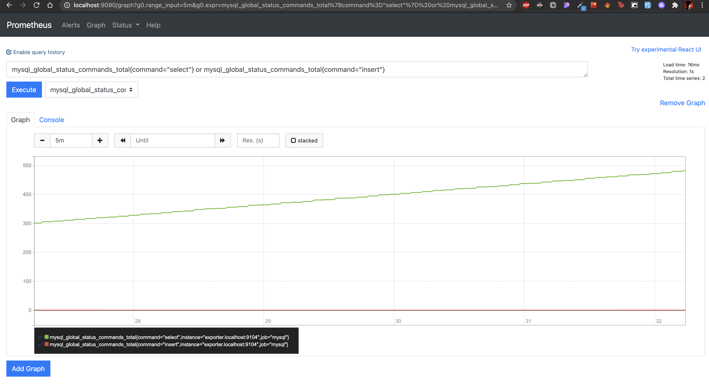

# Monitoring avec Prometheus

Le but de ce TP a été de connecter les logs d'une base de données MySQL avec une base de données orientée temps : Prometheus.

## Quesako ?

Prometheus c'est un utilitaire permettant de récupérer des données exportées d'un outil quelconque afin d'obtenir un monitoring de ces actions.

### Le projet

```yaml
version: '3'
services: 
    prometheus:
        image: prom/prometheus
        ports: 
            - 9090:9090
        volumes: 
            - ./config/prometheus.yml:/etc/prometheus/prometheus.yml
        networks: 
            monitoring:
                aliases: 
                    - prometheus.localhost
    database:
        image: mariadb:10.5
        environment:
            MYSQL_ROOT_PASSWORD: password
        volumes:
            - ./database:/var/lib/mysql
            - ./scripts:/docker-entrypoint-initdb.d/
        ports: 
            - 3306
        networks: 
            monitoring:
                aliases: 
                    - database.localhost
    exporter:
        image: prom/mysqld-exporter
        environment: 
            DATA_SOURCE_NAME: "mysqld_exporter:passwordExporter@(database.localhost:3306)/"
        ports: 
            - 9104:9104
        networks: 
            monitoring:
                aliases: 
                    - exporter.localhost
networks: 
    monitoring:
```

Pour utiliser Prometheus avec MysqlExporter, il faut créer un utilisateur dans la base de données avec les droits correspondants.

```sql
CREATE USER 'mysqld_exporter'@'%' IDENTIFIED BY 'passwordExporter';

GRANT PROCESS, REPLICATION CLIENT SELECT ON *.* TO 'mysqld_exporter'@'%';
FLUSH PRIVILEGES;
EXIT
```

Grâce à ce docker-compose et ce script on a quelque chose de fonctionnel.

J'ai eu quelques difficultés à trouver comment faire pour obtenir des graphiques avec PromQL mais au final je m'en suis bien sorti :)




On a, grâce à ce graphique, la variation du taux d'opérations de lectures et d'écritures en prenant en compte la moyenne sur les 5 dernières minutes.